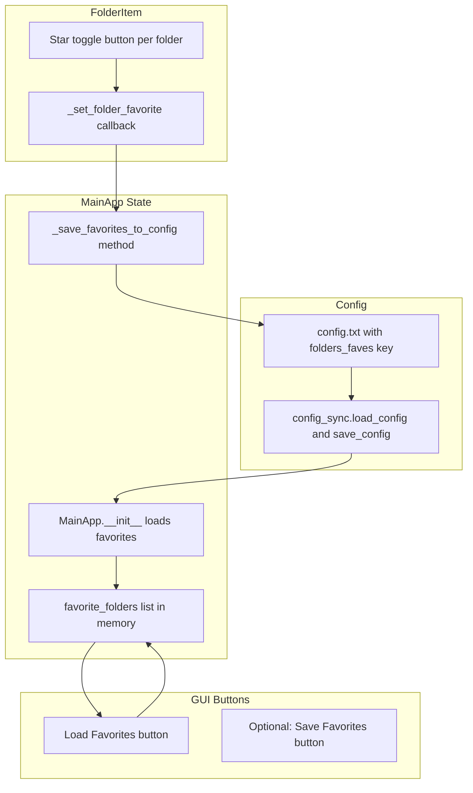

# Plan: GUI Favorites Feature Implementation

Plan name: 251115_gui_favorites
User query: `.roo/docs/plans/plan_20251115_gui_favorites_user.md`
Log file: `.roo/docs/plans/plan_251115_gui_favorites_log.md`
Autonomy level: High
Testing type: Use pytest

## Objective
Implement a comprehensive favorites feature for the GUI that allows users to save and quickly load their preferred folder sets. This includes config persistence, UI elements (buttons and per-folder star toggles), and state management.

## Architecture

## Implementation Tasks

Task 01: Extend config_sync.py to parse folders_faves as comma-separated list
Mode hint: /code-monkey
Action: Modify `utils_sync/config_sync.py` to handle `folders_faves` key similar to `ignore_patterns` and `root_allowlist`.
- In load_config: parse `folders_faves` as comma-separated list, default to empty list
- In save_config: serialize list back to comma-separated format
- Follow existing patterns for list handling
Acceptance: Config parser correctly loads/saves `folders_faves=/path1,/path2` format

Task 02: Add pytest tests for folders_faves config parsing
Mode hint: /tester
Action: Create tests in `tests/test_config_sync.py` for the new `folders_faves` functionality.
Test cases:
- `test_folders_faves_parsing_list`: Verify comma-separated paths parse correctly
- `test_folders_faves_missing_defaults_to_empty`: Test default empty list behavior
- `test_folders_faves_round_trip`: Save and reload config preserves values
Acceptance: All tests pass with pytest

Task 03: Add favorite_folders state to MainApp
Mode hint: /code-monkey
Action: Modify `main_gui.py` MainApp class to add favorites state management.
- In `__init__`: Add `self.favorite_folders = []` and load from config after config load
- Normalize paths using `file_path_utils.normalize_path()`
- Create helper method `_save_favorites_to_config()` that updates config and calls `config_sync.save_config()`
Acceptance: MainApp initializes with favorites from config

Task 04: Add favorite toggle to FolderItem widget
Mode hint: /front-end
Action: Modify `utils_sync/ui_utils.py` FolderItem class to add star toggle.
- Add star button with ☆/★ text toggle
- Accept `is_favorite` boolean and `toggle_favorite_callback` in constructor
- Track state in `self.is_favorite`
- Update visual state on toggle
- Call callback with folder path when clicked
Acceptance: Each folder row shows working star toggle

Task 05: Implement _set_folder_favorite method in MainApp
Mode hint: /code-monkey
Action: Add `_set_folder_favorite(folder_path, is_favorite)` method to `main_gui.py` MainApp.
- Normalize folder_path
- Add/remove from `self.favorite_folders` based on is_favorite flag
- Call `_save_favorites_to_config()` to persist
- Avoid duplicates when adding
Acceptance: Toggling star persists favorites to config

Task 06: Update _update_folder_list_ui to wire favorite toggles
Mode hint: /code-monkey
Action: Modify `_update_folder_list_ui()` in `main_gui.py` to connect favorites.
- Check if each folder_path is in `self.favorite_folders`
- Pass `is_favorite` boolean to FolderItem constructor
- Pass `_set_folder_favorite` as callback via lambda
Acceptance: Star toggles reflect current favorite status

Task 07: Add Load Favorites button to main GUI
Mode hint: /front-end
Action: Add "Load Favorites" button to button_frame in `main_gui.py`.
- Place in button_frame grid after Scan button
- Wire to new `_load_favorite_folders()` method
- Follow existing button styling
Acceptance: Load Favorites button appears and is clickable

Task 08: Implement _load_favorite_folders method
Mode hint: /code-monkey
Action: Create `_load_favorite_folders()` method in `main_gui.py` MainApp.
- Iterate through `self.favorite_folders`
- Normalize each path
- Validate: exists, is_file or has_roo_dir
- Skip invalid favorites (optionally log or message)
- Add valid folders to `self.selected_folders` if not already present
- Call `_update_folder_list_ui()` to refresh display
- Handle idempotent behavior (clicking multiple times)
Acceptance: Clicking Load Favorites populates folder list with saved favorites

Task 09: Optional: Add Save Favorites button
Mode hint: /front-end
Action: Add optional "Save Favorites" button to quickly save current selection.
- Create `_save_current_selection_as_favorites()` method
- Set `self.favorite_folders = list(self.selected_folders)`
- Call `_save_favorites_to_config()`
- Optional: Show confirmation message
Acceptance: Save Favorites button updates favorites to current selection

Task 10: Manual GUI testing of favorites workflow
Mode hint: /tester
Action: Manually test the full favorites workflow using the GUI.
Test scenarios:
- Star folders, verify config.txt updated
- Restart app, verify stars preserved
- Click Load Favorites, verify folders loaded
- Invalid favorite handling (deleted folder)
- Multiple clicks of Load Favorites (idempotence)
- Save Favorites button (if implemented)
Acceptance: All scenarios work as expected, no crashes

## Notes
- UI uses simple text-based stars (☆/★) to minimize dependencies
- Favorites persist to `config.txt` as `folders_faves=/path1,/path2`
- Feature is GUI-only; CLI behavior unchanged
- Removing folders from selected list does NOT remove from favorites
- Path normalization ensures consistent matching