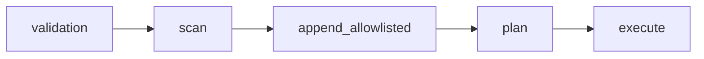

# AgentFlow File Sync

Sync the `.roo/` rules/docs folders across multiple project directories safely and reproducibly. The utility compares modification times and copies the newest version of each file to older peers, with dry-run, timestamped backups, atomic writes, and live progress.

## What this is

A small, focused app inside this repo to keep your `.roo/` directory consistent across projects. Use the desktop GUI or the CLI:
- GUI: [main_gui.py](main_gui.py)
- CLI: [cli_sync.py](cli_sync.py)
- Core engine: [utils_sync/sync_core.py](utils_sync/sync_core.py)

## Key features

- Multi-folder sync for `.roo/` subdirectories
- mtime-based conflict resolution (copy newest to older)
- Dry-run mode to preview changes
- Timestamped backups before overwriting (optional)
- Atomic writes (temp file + rename) to avoid partial copies
- Ignore patterns for files/folders you do not want to sync
- Threaded worker for responsive GUI with progress events
- Simple, human-editable [config.txt](config.txt)
- Cross-platform (Windows/macOS/Linux)

## How it works

The engine orchestrates a scan → plan → execute workflow:
- Scan: [SyncEngine.scan_folders()](utils_sync/sync_core.py:50) builds an index of files under each folder's `.roo/`
- Plan: [SyncEngine.plan_actions()](utils_sync/sync_core.py:123) decides copy operations using newest mtime as source
- Execute: [SyncEngine.execute_actions()](utils_sync/sync_core.py:175) performs safe, atomic copies with optional backups

## Main components

- Engine: [SyncEngine.__init__()](utils_sync/sync_core.py:36) in [utils_sync/sync_core.py](utils_sync/sync_core.py) holds config and an event queue and emits progress
- Worker: [SyncWorker.run()](utils_sync/sync_worker.py:40) coordinates scan/plan/execute on a background thread for the GUI
- Events: [EventType](utils_sync/progress_events.py:15), [ProgressEvent](utils_sync/progress_events.py:25), and [make_event()](utils_sync/progress_events.py:44) standardize messages shown in the UI and CLI
- Paths: [file_path_utils.has_roo_dir()](utils_sync/file_path_utils.py:85) and [file_path_utils.get_roo_relative_path()](utils_sync/file_path_utils.py:109) ensure only real `.roo/` directories are synced and compute relative paths
- Config I/O: [config_sync.save_config()](utils_sync/config_sync.py:95) persists settings atomically; defaults are loaded automatically
- Logging: [logger.init_logger()](utils_sync/logger.py:47) and [logger.log_event()](utils_sync/logger.py:236) write a rolling JSONL log and a human-readable plan log

## Installation

1) Ensure Python 3.9+ is installed
2) Clone this repo
3) Optional but recommended: create and activate a virtual environment
4) Install dependencies:
   ```
   pip install -r requirements.txt
   ```
   The only dependency is `python-dotenv` for .env file support

## Quick start

GUI

- Launch: 
  ```
  python main_gui.py
  ```
- In the window, click Add Folder and select two or more project roots that each contain a `.roo/` directory
- Open Settings to adjust dry-run, backup mode, and ignore patterns
- Click Start Sync to preview or apply changes

CLI

- Run headless sync:
  ```
  python cli_sync.py <folder1> <folder2> [<folder3> ...]
  ```
- Requirements:
  - At least two folders; each must contain a `.roo/` directory or the tool exits with code 1
- Exit codes:
  - 0: success
  - 1: argument/validation error
  - 2: runtime failure

## Configuration

### Config File Location

By default, the app reads settings from `config.txt` in the project root. You can override this in three ways:

1. Environment variable via `.env` file:
   ```
   AGENTFLOW_CONFIG=/path/to/custom-config.txt
   ```

2. CLI flag:
   ```
   python cli_sync.py --config /path/to/custom-config.txt folder1 folder2
   ```

3. Default fallback: `config.txt` in project root

Priority order: CLI flag > environment variable > default

### Config File Format

Example `config.txt`:

```
# window size for GUI (pixels)
window_width=1000
window_height=720

# root-level allowlist for files above .roo (for example: .roomodes)
root_allowlist=.roomodes
ignore_patterns=.git,__pycache__,.venv,.idea,.vscode,node_modules,*.pyc,database_schema.md,useful.md

# comma-separated names to ignore anywhere under .roo
# typical: .git,__pycache__,node_modules,build
ignore_patterns=.git,__pycache__,node_modules

# "none" or "timestamped"
backup_mode=timestamped

# if true, collect and display actions but do not modify files
dry_run=true

# if true, keep source modified times (copy2 already preserves on most platforms)
preserve_mtime=true
```

- Root-level allowlist example (`config.txt`):
  - root_allowlist=.roomodes

## Behavior and guarantees

- Scope: By default, only the `.roo/` subtree of each folder is scanned and synced, but `.roomodes` will be included if folder "above" `.roo/` is picked and `.roomodes` is present in `root_allowlist`.
- Default (root-level files): No root-level scanning occurs unless opted-in via `root_allowlist`.
- Conflict resolution: The newest mtime wins; the latest copy becomes the source for all older peers
- Backups: If `backup_mode=timestamped` and a destination exists, it is renamed with an ISO timestamp suffix before copy
- Atomicity: Copies write to a temp file in the destination directory then rename into place to avoid partial writes
- Safety rails: only include regular files (no symlinks), require a real `.roo/` folder, recommended size cap ~256 KB, and always respect `ignore_patterns`
- Symlinks: A symlinked `.roo/` is treated as absent by `utils_sync/file_path_utils.has_roo_dir()`
- Non-destructive: The current implementation copies newer files to older ones and does not delete files

## Tips

- Start with `dry_run=true` to verify actions
- Add noisy or large folders to `ignore_patterns`
- Keep one canonical project as your "source of truth" and run sync from it first

## Troubleshooting

- Error: Folder does not contain `.roo/` directory: Ensure each selected path has a `.roo/` folder at its top level
- Permission denied: On Windows, run the terminal as Administrator or move the projects to a writable location
- Paths with spaces: Quotes are not required in the GUI; for CLI, wrap paths in quotes if your shell needs it
- Nothing happens in non-dry runs: Check antivirus or file locks; the app uses atomic replace operations that can be blocked

## Developing and tests

- Core logic and unit tests live under `utils_sync/` and `tests/`
- Example: [tests/test_sync_core.py](tests/test_sync_core.py) verifies newest-wins planning
- Contribute improvements by keeping modules small and functions documented
- Run tests with pytest tests/

## Root-Level File Allowlist

A short opt-in mechanism to allow syncing a small set of files from a project root in addition to the default `.roo/` subtree.

- Summary: preserve the default behavior of scanning only `.roo/` (the safe, opt-in default). When enabled, an optional root-level allowlist can include specific filenames (for example, `.roomodes`) which will be appended to the index after the `.roo/` scan and indexed under a synthetic relative key equal to the filename (example: `.roomodes`) so they do not collide with `.roo/` keys.

- Config key and example (see `config.txt`):
  - root_allowlist=.roomodes

- Default behavior:
  - No scanning outside `.roo/` occurs unless files are explicitly allowlisted.

- Safety rails:
  - Require a real, non-symlink `.roo/` folder for a project to be eligible for syncing.
  - Only include files that exist, are regular files (not directories), and are not symlinks.
  - Optional size cap recommended (e.g., 256 KB) to avoid very large files being pulled in.
  - Respect existing ignore patterns by name (files matching `ignore_patterns` are skipped).

- Scan behavior summary:
  - The engine first scans the `.roo/` subtree as before.
  - After `.roo/` is scanned, any root files present in `root_allowlist` are appended to the index and assigned a synthetic relative key equal to the filename (for example: `.roomodes`) so they are indexed alongside `.roo/` entries without colliding with `.roo/` keys.
  - These allowlisted root entries participate in the normal plan → execute workflow.

- Code references:
  - Implementation and config I/O: `utils_sync/config_sync.py`
  - Scan/append behavior: `utils_sync/sync_core.py`

- Mermaid flow (validation → scan → append allowlisted → plan → execute):



- Short acceptance criteria:
  - This "Root-Level File Allowlist" section exists in `README-file-sync.md`.
  - The example config snippet above matches the new `config.txt` entry referenced at `config.txt`.
  - The README mentions the safety checks and the `root_allowlist` configuration.
  - The README includes the short mermaid flow showing: validation → scan → append allowlisted → plan → execute.

## Related docs
 
- High-level project readme: `README.md`
- This module’s engine: `utils_sync/sync_core.py`
- CLI wrapper: `cli_sync.py`
- GUI app: `main_gui.py`